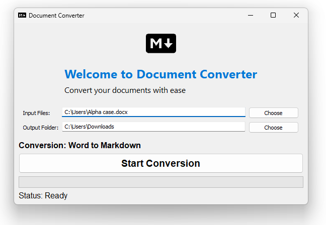

# Markdown-Word-Excel Converter (Pandoc)

Document Converter is a Go-based application designed to convert .docx and .xlsx documents into Markdown format while preserving text styles and formatting.



## Features

- Converts text with styling (bold, italic) into Markdown format.
- Handles document headers and formats them as Markdown headings.
- Converts lists and formats them accordingly in Markdown.
- Converts Excel tables into Markdown format.

## Usage

1. Clone or download the repository to your local machine.
2. Make sure Go is installed on your system.
3. Open the terminal and navigate to the project directory.
4. Run the following command to compile the program:

   ```bash
   go build -o DocumentConverter
   ```

5. To convert a document, run the compiled executable with the input file path and output directory as arguments. For example:

   ```bash
   ./DocumentConverter input.docx /output/directory
   ```

6. The converted Markdown file will be saved in the specified output directory.

## Use Cases

### Converting Word (.docx) to Markdown

1. Select a .docx file and specify an output directory.
2. Click the "Start Conversion" button.
3. The file will be converted to Markdown and saved in the specified directory.

### Converting Excel (.xlsx) to Markdown

1. Select a .xlsx file and specify an output directory.
2. Click the "Start Conversion" button.
3. The file will be converted to a Markdown table and saved in the specified directory.

### Converting Markdown (.md) to Word (.docx)

1. Select a .md file and specify an output directory.
2. Click the "Start Conversion" button.
3. The file will be converted to a Word document and saved in the specified directory.

## Automatic Scenario Selection

The application automatically selects the appropriate formatting scenario based on the selected file type:
- If you choose a .docx file, it converts it to Markdown.
- If you choose a .xlsx file, it converts it to a Markdown table.
- If you choose a .md file, it converts it to a .docx Word document.

## How to Compile

### Prerequisites

- Go installed on your system.

### Steps:

1. Download or clone the repository.
2. Open a terminal and navigate to the project directory.
3. Run the command:

   ```bash
   go build -o DocumentConverter
   ```

4. The program will be compiled, and you can use it to convert documents.

## Platform Compatibility

- The program is initially designed for Windows, but it can be adapted for macOS and Linux by replacing the `walk` (GUI) library with cross-platform alternatives or by using a console mode.

